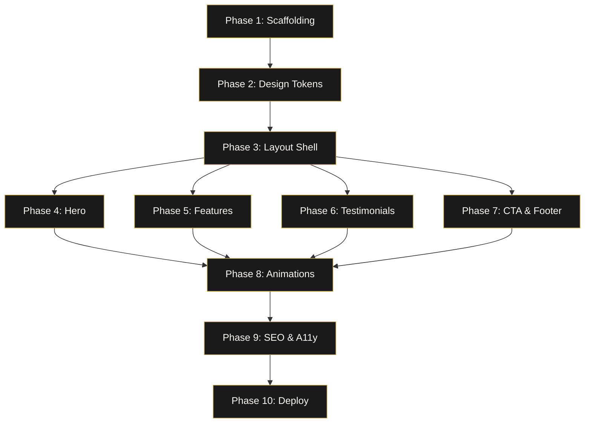

# PMR Devotion — Landing Page Website Implementation Plan

> **Goal**: Build a premium-quality, Forbes-inspired landing page for the PMR Devotion app at `pmrdevotion.agowt.com`, hosted from the `agowt/pmrdevotion` GitHub repository.

---

## Table of Contents

1. [Project Overview](#1-project-overview)
2. [Design Philosophy — Forbes-Inspired Patterns](#2-design-philosophy--forbes-inspired-patterns)
3. [Complete Website Copy](#3-complete-website-copy)
4. [Phase 1: Project Scaffolding](#phase-1-project-scaffolding)
5. [Phase 2: Design System & Tokens](#phase-2-design-system--tokens)
6. [Phase 3: Global Layout Shell](#phase-3-global-layout-shell)
7. [Phase 4: Hero Section](#phase-4-hero-section)
8. [Phase 5: Feature Sections](#phase-5-feature-sections)
9. [Phase 6: Social Proof & Testimonials](#phase-6-social-proof--testimonials)
10. [Phase 7: Download CTA & Footer](#phase-7-download-cta--footer)
11. [Phase 8: Animations & Polish](#phase-8-animations--polish)
12. [Phase 9: SEO, Performance & Accessibility](#phase-9-seo-performance--accessibility)
13. [Phase 10: Deployment & DNS](#phase-10-deployment--dns)
14. [Dependency Graph](#dependency-graph)
15. [Validation Checklist](#validation-checklist)

---

## 1. Project Overview

| Item | Detail |
|---|---|
| **App Name** | PMR Devotion |
| **Tagline** | Pray. Meditate. Repeat. |
| **Positioning** | A system of Devotion designed to edify Christians through structured, Scripture-rooted prayer and pattern awareness |
| **Domain** | `pmrdevotion.agowt.com` |
| **Repository** | `agowt/pmrdevotion` on GitHub |
| **Hosting** | GitHub Pages with custom CNAME |
| **Tech Stack** | Static HTML + Vanilla CSS + Vanilla JS (no framework — fast, deployable, zero dependencies) |
| **Design Reference** | Forbes.com editorial layout patterns |

> **IMPORTANT**: The website is a **single-page landing page** (not a multi-page editorial site). We adapt Forbes's visual language — its typography authority, grid discipline, bold hero sections, and editorial card patterns — into a product marketing page for a devotional app.

---

## 2. Design Philosophy — Forbes-Inspired Patterns

### What we take from Forbes

| Forbes Pattern | PMR Devotion Adaptation |
|---|---|
| **Sticky top navigation bar** with logo left, links right | Sticky nav with PMR Devotion wordmark left, section anchors + CTA button right |
| **Bold hero section** — large headline, category label, supporting image | Full-viewport hero with "Pray. Meditate. Repeat." headline, app description, and phone mockup |
| **Card-based content grid** — 2-3 column editorial cards | Feature cards in a 3-column grid showcasing app capabilities |
| **Clean serif + sans-serif type pairing** | Playfair Display (serif headings) + Inter (sans-serif body) |
| **Confident, authoritative colour palette** — predominantly dark with accent pops | Deep charcoal (#111) background, warm gold (#C8A951) accent, ivory (#FAF8F5) text |
| **Thin horizontal dividers** between content sections | Subtle gold-tinted divider lines between each section |
| **Ample whitespace** and vertical rhythm | Generous section padding (100px+), consistent spacing scale |
| **Editorial pull-quotes** | Scripture pull-quotes between sections |
| **Category badges** on cards | Feature category labels (Prayer · Patterns · Scripture) |

### Colour Palette

| Token | Value | Usage |
|---|---|---|
| `--bg-primary` | `#0D0D0D` | Page background |
| `--bg-secondary` | `#1A1A1A` | Card / section backgrounds |
| `--bg-elevated` | `#242424` | Hover states, elevated cards |
| `--text-primary` | `#FAF8F5` | Headlines, primary text |
| `--text-secondary` | `#B8B0A8` | Body copy, descriptions |
| `--text-muted` | `#6E6560` | Captions, legal text |
| `--accent` | `#C8A951` | CTAs, badges, highlights, dividers |
| `--accent-hover` | `#D4BA6A` | Accent hover states |
| `--accent-subtle` | `rgba(200, 169, 81, 0.12)` | Accent background tints |
| `--surface-glass` | `rgba(255, 255, 255, 0.04)` | Glassmorphism overlays |

### Typography

| Role | Font | Weight | Size |
|---|---|---|---|
| Display heading | Playfair Display | 700 | 64px / 48px mobile |
| Section heading | Playfair Display | 600 | 36px / 28px mobile |
| Subheading | Inter | 600 | 20px / 18px mobile |
| Body | Inter | 400 | 16px / 15px mobile |
| Caption | Inter | 400 | 13px |
| Button | Inter | 600 | 15px, letter-spacing 0.5px |
| Nav link | Inter | 500 | 14px |
| Pull-quote | Playfair Display italic | 400 | 24px |

---

## 3. Complete Website Copy

### Navigation

```
PMR Devotion [logo/wordmark]

Features    How It Works    Scripture    Premium    Download
```

### Hero Section

```
Category badge: "A DEVOTION FRAMEWORK"

Headline:
Pray. Meditate. Repeat.

Subheadline:
Build a focused, Scripture-rooted prayer life with structured devotion,
prayer, meditation, and pattern awareness over time.

CTA Primary:   "Download Free on iOS"
CTA Secondary: "Coming to Android"

Trust line: "No account required · Start immediately · Your journal stays private"
```

### Scripture Pull-Quote (Divider #1)

```
"Be still, and know that I am God."
— Psalm 46:10
```

### Features Section

```
Section heading: "Built for Depth, Not Distraction"
Section subline: "Every detail designed to draw you closer."

Feature Card 1 — PRAYER
Title: "Scripture-Anchored Prayers"
Description: "Every prayer in PMR Devotion is drawn directly from the Bible.
Not generated text. Not generic prompts. Scripture-anchored prayers
shaped for devotion — faithful to the text, reverent in tone."

Feature Card 2 — PATTERNS
Title: "Understand Your Prayer Patterns"
Description: "Notice what themes repeat when you pray,
how your focus strengthens, and where to respond earlier with clarity.
Pray more precisely, become more organised, and spiritually attentive."

Feature Card 3 — DEVOTION
Title: "A Focused Devotional Life"
Description: "Build a steadier devotion system through structured
Scripture-based sessions, meditation on the glory and praises of God,
and pattern awareness that grows with you over time."

Feature Card 4 — MEDITATION
Title: "Guided Meditation Rooted in Scripture"
Description: "Move beyond surface-level quiet times. Start focused
meditation sessions that pair curated Scripture texts on the glory and praises of God with prayerful reflection."

Feature Card 5 — EMOTIONAL AWARENESS
Title: "Name What Part of Your Devotion You Want to Strengthen"
Description: "Begin your journey by identifying the area(s) of devotion you would like to strengthen. Choose from areas like Consistency, Focus, Depth, or Scripture-led prayers — and access Bible passage and prayers that match."

Feature Card 6 — JOURNAL
Title: "Your Private Devotion Journal"
Description: "Every selected theme is recorded. Every pattern is tracked.
Build a living record of your devotion life that reveals growth and patterns you might otherwise miss. Syncs securely across devices when you sign in."
```

### How It Works Section

```
Section heading: "Three Steps. One System."

Step 1:
Number: "01"
Title: "Pray"
Description: "Open the app and select up to three themes.
Overwhelmed? Grateful? Seeking wisdom? PMR Devotion meets you where you are. The app highlights a curated Scripture passage matched to your selected theme, followed by selected prayers from Scripture."

Step 2:
Number: "02"
Title: "Meditate"
Description: "Meditate on the glory and praises of God. Contemplate His glory and be transformed by a view of it."

Step 3:
Number: "03"
Title: "Repeat"
Description: "Pray. Meditate. Repeat. Watch patterns emerge - Grow in depth."
```

###  Profile Quote (Divider #2)

```
"Christian contentment is that sweet, inward, quiet, gracious frame of spirit, which freely submits to and delights in God's wise and fatherly disposal in every condition."
Profile — Jeremiah Burroughs (1599-1646)
```

### Premium Section

```
Section heading: "Go Deeper with Premium"
Section subline: "Stay close to the patterns surfacing in your life."

Premium Feature Bullets:
• Full history and trend insights
• Saved profiles and journal continuity
• Pattern review across week, month, and all time
• Secure sync across devices

Pricing Cards:

Yearly — $34.99/yr
"Best value — save 42% compared with monthly"
Badge: "BEST VALUE"

6 Months — $19.99
"Save 33% compared with monthly"
Badge: "POPULAR"

Monthly — $4.99/mo
"Flexible entry with full premium access"

Footnote: "Cancel anytime. Your purchase is managed securely through
Apple or Google. No account required to start free."
```

### Social Proof / Testimonials Section

```
Section heading: "What Users Are Saying"

Testimonial 1:
"For the first time, I feel like my prayer life has structure without
feeling rigid. PMR Devotion gives me the framework I was missing."
— Early Beta User

Testimonial 2:
"The pattern tracking changed everything. I can actually see how my
prayer focus has deepened over the past three months."
— Beta Tester

Testimonial 3:
"Rooted in Scripture, not in algorithms. That's what makes
this different from every other devotional app I've tried."
— Beta Tester
```

> **NOTE**: These are placeholder testimonials. Replace with real user quotes as they become available from TestFlight feedback.

### Download / Final CTA Section

```
Headline: "Redefine Your Devotion Framework."

Sublines:
"Pray often."
"Meditate on the glory and praises of God."
"Repeat."

CTA Primary: "Download Free on iOS"
CTA Secondary: "Coming to Android"

Badge: "Pray. Meditate. Repeat."
```

### Footer

```
PMR Devotion
Pray. Meditate. Repeat.

Links:
Privacy Policy    Terms of Service    Support

Social:
[App Store Badge]

Legal:
© 2026 AGOWT. All rights reserved.
PMR Devotion is a product of AGOWT.

"Faithful to Scripture."
```

---

## Phase 1: Project Scaffolding

**Purpose**: Set up the static site structure in the `agowt/pmrdevotion` repository.

### Files to Create

| File | Purpose |
|---|---|
| `index.html` | Main landing page |
| `css/tokens.css` | Design tokens (colours, typography, spacing) |
| `css/reset.css` | CSS reset / normalize |
| `css/layout.css` | Grid system, section containers |
| `css/components.css` | Card, button, badge, nav styles |
| `css/animations.css` | Scroll-triggered animations, hover effects |
| `css/responsive.css` | Breakpoint overrides (mobile, tablet, desktop) |
| `js/main.js` | Intersection Observer animations, smooth scroll, mobile nav toggle |
| `images/` | Directory for app mockups, icons, badges |
| `CNAME` | Contains `pmrdevotion.agowt.com` for GitHub Pages |
| `privacy.html` | Privacy policy page (may already exist or be linked from agowt.com) |
| `.nojekyll` | Prevents GitHub Pages Jekyll processing |

### Tasks

- [ ] **T1.1**: Create directory structure: `css/`, `js/`, `images/`
- [ ] **T1.2**: Create `CNAME` file with content `pmrdevotion.agowt.com`
- [ ] **T1.3**: Create `.nojekyll` empty file
- [ ] **T1.4**: Create skeleton `index.html` with HTML5 boilerplate, `<head>` with meta tags, Google Fonts links (Playfair Display + Inter), and CSS includes
- [ ] **T1.5**: Create empty CSS files (`tokens.css`, `reset.css`, `layout.css`, `components.css`, `animations.css`, `responsive.css`)
- [ ] **T1.6**: Create empty `js/main.js`

### Validation

- [ ] `index.html` loads in browser without errors
- [ ] Google Fonts load (network tab shows font requests)
- [ ] All CSS files linked and parsed (no 404s in console)

---

## Phase 2: Design System & Tokens

**Purpose**: Establish the visual foundation — every subsequent phase references these tokens.

> **IMPORTANT**: This phase must be completed before any visual component work begins. All colours, fonts, and spacing must come from tokens — never hard-coded in component CSS.

### Files to Create/Modify

| File | Action | Purpose |
|---|---|---|
| `css/tokens.css` | CREATE | CSS custom properties for colours, typography, spacing, radii, shadows |
| `css/reset.css` | CREATE | Modern CSS reset (box-sizing, margin reset, font smoothing) |

### Token Specification

```css
/* tokens.css — specification for implementer */

:root {
  /* Colour Palette */
  --bg-primary: #0D0D0D;
  --bg-secondary: #1A1A1A;
  --bg-elevated: #242424;
  --text-primary: #FAF8F5;
  --text-secondary: #B8B0A8;
  --text-muted: #6E6560;
  --accent: #C8A951;
  --accent-hover: #D4BA6A;
  --accent-subtle: rgba(200, 169, 81, 0.12);
  --surface-glass: rgba(255, 255, 255, 0.04);
  --divider: rgba(200, 169, 81, 0.15);
  --error: #CF6679;

  /* Typography Scale */
  --font-serif: 'Playfair Display', Georgia, serif;
  --font-sans: 'Inter', -apple-system, system-ui, sans-serif;

  --fs-display: clamp(2.5rem, 5vw, 4rem);
  --fs-h2: clamp(1.75rem, 3vw, 2.25rem);
  --fs-h3: clamp(1.125rem, 2vw, 1.25rem);
  --fs-body: clamp(0.9375rem, 1.5vw, 1rem);
  --fs-caption: 0.8125rem;
  --fs-button: 0.9375rem;
  --fs-nav: 0.875rem;
  --fs-pull-quote: clamp(1.25rem, 2.5vw, 1.5rem);

  --lh-display: 1.1;
  --lh-heading: 1.3;
  --lh-body: 1.65;
  --lh-caption: 1.4;

  /* Spacing Scale (8px base) */
  --space-4: 0.25rem;
  --space-8: 0.5rem;
  --space-12: 0.75rem;
  --space-16: 1rem;
  --space-24: 1.5rem;
  --space-32: 2rem;
  --space-48: 3rem;
  --space-64: 4rem;
  --space-80: 5rem;
  --space-100: 6.25rem;
  --space-120: 7.5rem;

  /* Container */
  --container-max: 1200px;
  --container-narrow: 800px;
  --container-padding: var(--space-24);

  /* Radii */
  --radius-sm: 4px;
  --radius-md: 8px;
  --radius-lg: 16px;
  --radius-pill: 100px;

  /* Shadows */
  --shadow-card: 0 2px 12px rgba(0, 0, 0, 0.3);
  --shadow-elevated: 0 8px 32px rgba(0, 0, 0, 0.4);

  /* Transitions */
  --ease-out: cubic-bezier(0.16, 1, 0.3, 1);
  --duration-fast: 150ms;
  --duration-normal: 300ms;
  --duration-slow: 500ms;
}
```

### Tasks

- [ ] **T2.1**: Implement `css/tokens.css` with all custom properties from the specification above
- [ ] **T2.2**: Implement `css/reset.css` with modern reset (include `*, *::before, *::after { box-sizing: border-box; }`, body margin/font reset, `font-smoothing`, image block-display, reduced-motion query)
- [ ] **T2.3**: Verify tokens load — inspect a test element styled with `var(--accent)` in browser DevTools

### Validation

- [ ] All CSS custom properties resolve (no `unset` warnings in DevTools)
- [ ] Body text renders in Inter; a test heading renders in Playfair Display
- [ ] Background colour is `#0D0D0D`

---

## Phase 3: Global Layout Shell

**Purpose**: Build the page skeleton — sticky nav, section containers, footer structure.

### Files to Create/Modify

| File | Action | Purpose |
|---|---|---|
| `css/layout.css` | CREATE | Container utilities, section spacing, grid system |
| `css/components.css` | CREATE (partial) | Navigation bar and footer styles |
| `index.html` | MODIFY | Add nav, section wrappers, footer HTML |

### Section Structure (HTML)

```
<body>
  <nav id="site-nav">              <!-- Sticky nav bar -->
  <main>
    <section id="hero">            <!-- Full-viewport hero -->
    <aside class="pull-quote">     <!-- Scripture divider #1 -->
    <section id="features">        <!-- 3x2 feature card grid -->
    <section id="how-it-works">    <!-- 3-step numbered flow -->
    <aside class="pull-quote">     <!-- Scripture divider #2 -->
    <section id="premium">         <!-- Pricing cards -->
    <section id="testimonials">    <!-- Social proof cards -->
    <section id="download">        <!-- Final CTA -->
  </main>
  <footer id="site-footer">       <!-- Links, legal, badge -->
</body>
```

### Layout CSS Specification

- `.container` — max-width `var(--container-max)`, horizontal auto margins, padding `var(--container-padding)`
- `.container--narrow` — max-width `var(--container-narrow)`
- `.section` — padding-block `var(--space-100)` desktop, `var(--space-64)` mobile
- `.grid-2` — 2-column grid, gap `var(--space-32)`
- `.grid-3` — 3-column grid, gap `var(--space-24)`
- Both grids collapse to 1-column below 768px

### Navigation Specification

- Position: `sticky`, top: 0, z-index: 1000
- Background: `var(--bg-primary)` with `backdrop-filter: blur(12px)` and slight transparency
- Height: 64px
- Left: PMR Devotion wordmark in `var(--accent)` — Playfair Display, 18px, 600 weight
- Right: anchor links (Features, How It Works, Scripture, Premium) in `var(--text-secondary)`, hover to `var(--text-primary)`
- Far right: "Download" pill button — `var(--accent)` background, `var(--bg-primary)` text
- Mobile: hamburger icon, slide-in overlay menu (full-screen, `var(--bg-primary)` background)
- Bottom border: 1px `var(--divider)`

### Footer Specification

- Background: `var(--bg-secondary)`
- Top border: 1px `var(--divider)`
- Three columns on desktop: Brand (logo + tagline), Links, Legal
- Collapses to stacked on mobile
- Links: Privacy Policy, Terms of Service, Support
- Legal line: `© 2026 AGOWT. All rights reserved.`
- Closing statement: `"Faithful to Scripture."` in `var(--text-muted)` italic

### Tasks

- [ ] **T3.1**: Implement `css/layout.css` — containers, section spacing, grid utilities
- [ ] **T3.2**: Add nav HTML to `index.html` with wordmark, links, and CTA button
- [ ] **T3.3**: Add empty section wrappers for all 8 content sections in `index.html`
- [ ] **T3.4**: Add footer HTML to `index.html`
- [ ] **T3.5**: Style navigation in `css/components.css` — sticky, blur bg, responsive
- [ ] **T3.6**: Style footer in `css/components.css`
- [ ] **T3.7**: Implement mobile nav toggle in `js/main.js` (hamburger open/close, body scroll lock)

### Validation

- [ ] Nav sticks to top on scroll
- [ ] Nav links scroll smoothly to correct sections (test `scroll-behavior: smooth` on `html`)
- [ ] Footer renders with correct columns
- [ ] Mobile: hamburger shows, nav overlay works
- [ ] All sections have correct vertical spacing

### Dependencies

- Requires Phase 2 (tokens) complete

---

## Phase 4: Hero Section

**Purpose**: The first thing users see — must be stunning, authoritative, and clear.

### Files to Modify

| File | Action | Purpose |
|---|---|---|
| `index.html` | MODIFY | Add hero content HTML |
| `css/components.css` | MODIFY | Hero-specific styles |
| `images/` | ADD | App mockup image(s) for hero |

### Layout Specification

- Full viewport height (`min-height: 100vh`), flex centred
- Two-column layout on desktop: text left (60%), phone mockup right (40%)
- Single column on mobile: text stacked above mockup
- Subtle radial gradient overlay from centre-bottom (`var(--accent-subtle)` → transparent)
- Optional: very subtle floating particle/glow animation behind the phone mockup

### Content Elements

1. **Category badge**: Small pill — "A DEVOTION FRAMEWORK" — `var(--accent)` border, uppercase `var(--fs-caption)`, letter-spacing 2px
2. **Headline**: `<h1>` — "Pray. Meditate. Repeat." — `var(--font-serif)`, `var(--fs-display)`, `var(--text-primary)`
3. **Subheadline**: `<p>` — Copy from Section 3 — `var(--text-secondary)`, `var(--fs-body)`, max-width 520px
4. **CTA group**: Two buttons — Primary (filled gold), Secondary (outline/ghost)
5. **Trust line**: Caption text — "No account required · Start immediately · Your journal stays private"
6. **Phone mockup**: Generated image of the app (use `generate_image` tool during implementation)

### Tasks

- [ ] **T4.1**: Add hero HTML content to `#hero` section in `index.html`
- [ ] **T4.2**: Generate hero phone mockup image using the image generation tool — show the app's state selection or prayer screen on a phone
- [ ] **T4.3**: Style hero layout — full viewport, 2-column, centred
- [ ] **T4.4**: Style category badge pill
- [ ] **T4.5**: Style CTA buttons — primary (filled) and secondary (outline)
- [ ] **T4.6**: Style trust line
- [ ] **T4.7**: Add subtle radial gradient background effect
- [ ] **T4.8**: Animate hero content — fade-in + slight translate-up on load (CSS `@keyframes`)

### Validation

- [ ] Hero fills viewport on desktop and mobile
- [ ] Headline renders in Playfair Display serif
- [ ] CTAs have hover states (colour shift + subtle scale)
- [ ] Phone mockup is crisp and properly sized
- [ ] On mobile, layout stacks cleanly — text above image

### Dependencies

- Requires Phase 3 (layout shell) complete

---

## Phase 5: Feature Sections

**Purpose**: Showcase the app's core capabilities — this is the heart of the landing page.

### 5A: Scripture Pull-Quote Dividers

Two instances between sections. Implementation:

- Full-width, `var(--bg-secondary)` background
- Centre-aligned Playfair Display italic quote, `var(--fs-pull-quote)`
- Attribution in `var(--text-muted)`, `var(--fs-caption)`
- Thin `var(--divider)` top and bottom borders
- Vertical padding `var(--space-64)`

### 5B: Features Grid

Six feature cards in a 3×2 grid on desktop, 2×3 on tablet, 1×6 on mobile.

Each card:

- Background: `var(--bg-secondary)`, border: 1px `var(--divider)`, border-radius `var(--radius-lg)`
- Top: Category badge pill (e.g. "PRAYER", "PATTERNS", "DEVOTION") — uppercase, `var(--fs-caption)`, `var(--accent)` border
- Middle: Title in `var(--font-serif)`, `var(--fs-h3)`, `var(--text-primary)`
- Bottom: Description in `var(--text-secondary)`, `var(--fs-body)`
- Hover: Translate up 4px, border-colour shifts to `var(--accent)`, `var(--shadow-card)` appears
- Internal padding: `var(--space-32)`

### 5C: How It Works

Three numbered steps in a horizontal flow on desktop.

- Each step: Large number (`var(--accent)`, `var(--fs-display)`, opacity 0.3), title, description
- Connected by subtle horizontal line between steps (`var(--divider)`)
- Steps stack vertically on mobile

### 5D: Premium Section

- Left column: Feature bullet list with gold dot markers
- Right column: Three pricing cards stacked vertically
- Each pricing card: Title, price, cadence, savings text, optional badge ("BEST VALUE" / "POPULAR")
- Selected/recommended card (Yearly): `var(--accent)` left border highlight, `var(--accent-subtle)` background
- Small footnote text below

### Files to Modify

| File | Action |
|---|---|
| `index.html` | MODIFY — add all content HTML for sections 5A–5D |
| `css/components.css` | MODIFY — feature cards, pull quotes, step numbers, pricing cards |

### Tasks

- [ ] **T5.1**: Add pull-quote HTML for both divider instances
- [ ] **T5.2**: Style pull-quote component
- [ ] **T5.3**: Add features grid HTML — 6 cards with badges, titles, descriptions
- [ ] **T5.4**: Style feature card component — background, border, hover effect, badge
- [ ] **T5.5**: Add "How It Works" HTML — 3 numbered steps
- [ ] **T5.6**: Style step component — large number, connector line, responsive stacking
- [ ] **T5.7**: Add premium section HTML — bullet list + 3 pricing cards
- [ ] **T5.8**: Style pricing card component — borders, badge, highlighted card
- [ ] **T5.9**: Add premium section footnote

### Validation

- [ ] Feature cards render in 3-column grid on desktop, stack on mobile
- [ ] Card hover effect works (translate + border colour + shadow)
- [ ] Category badges display correctly in each card
- [ ] Step numbers show in large, faded accent colour
- [ ] Connector lines visible between steps on desktop
- [ ] Pricing cards display with correct hierarchy (yearly highlighted)
- [ ] Pull-quotes render in italic serif with attribution

### Dependencies

- Requires Phase 3 + Phase 4 complete

---

## Phase 6: Social Proof & Testimonials

**Purpose**: Build trust with user quotes.

### Layout

- Section heading: "What Users Are Saying"
- Three testimonial cards in a row on desktop (3-column grid)
- Each card: Quote text in `var(--font-serif)` italic, attribution below in `var(--text-muted)`
- Card style: `var(--surface-glass)` background, 1px `var(--divider)` border, `var(--radius-lg)`
- Large opening quotation mark as decorative element in `var(--accent)`, font-size 48px, opacity 0.3

### Tasks

- [ ] **T6.1**: Add testimonials section HTML — heading + 3 quote cards
- [ ] **T6.2**: Style testimonial card component
- [ ] **T6.3**: Add decorative quotation mark element

### Validation

- [ ] Cards render in 3-column grid, stack on mobile
- [ ] Decorative quote mark shows above each testimonial
- [ ] Attribution text is muted

### Dependencies

- Requires Phase 3 complete

---

## Phase 7: Download CTA & Footer

**Purpose**: Final conversion point — compelling call to action.

### Download CTA Section

- Dark background with subtle accent radial gradient (mirror hero)
- Centre-aligned
- Headline: "Redefine Your Devotion Framework." — Playfair Display, large
- Sublines stacked: "Pray often." / "Meditate on the glory and praises of God." / "Repeat."
- Two CTA buttons (same as hero)
- Below: PMR wordmark badge — "Pray. Meditate. Repeat."

### Tasks

- [ ] **T7.1**: Add download CTA section HTML
- [ ] **T7.2**: Style CTA section — gradient background, centred layout
- [ ] **T7.3**: Generate App Store badge image (or use official Apple badge SVG)
- [ ] **T7.4**: Verify footer links point to correct URLs (`/privacy.html`, support email, etc.)

### Validation

- [ ] CTA section visually distinct with gradient background
- [ ] Buttons match hero CTA styling exactly
- [ ] App Store badge renders (or placeholder until live)
- [ ] Footer links work

### Dependencies

- Requires Phase 3 complete

---

## Phase 8: Animations & Polish

**Purpose**: Add the micro-interactions and scroll animations that make the page feel premium.

### Scroll Animations (Intersection Observer)

All animated elements share a common pattern:

- Initial state: `opacity: 0; transform: translateY(20px);`
- Animated state: `opacity: 1; transform: translateY(0);`
- Transition: `var(--duration-slow)` with `var(--ease-out)`
- Trigger: element enters viewport (threshold: 0.15)
- Staggered children: each card delays by 100ms

### Elements to Animate

| Element | Animation |
|---|---|
| Hero headline + subheadline | Fade up on load (CSS-only, no observer) |
| Hero phone mockup | Fade up + slight float on load (delayed 200ms) |
| Feature cards | Staggered fade-up as grid enters viewport |
| Step numbers | Count-up or scale-in per step |
| Pull-quotes | Fade in from centre |
| Pricing cards | Staggered fade-up |
| Testimonial cards | Staggered fade-up |
| Download CTA | Fade in |

### Hover Effects

| Element | Hover Effect |
|---|---|
| Feature cards | `translateY(-4px)`, border colour to `var(--accent)`, shadow appears |
| Pricing cards | Border colour to `var(--accent)`, subtle glow |
| CTA buttons | Background lightens, subtle scale(1.02) |
| Nav links | Colour to `var(--text-primary)`, underline slides in from left |
| Footer links | Colour to `var(--accent)` |

### Files to Create/Modify

| File | Action |
|---|---|
| `css/animations.css` | CREATE — `@keyframes`, `.animate-in` utility classes, hover transitions |
| `js/main.js` | MODIFY — Intersection Observer setup for scroll-triggered animations |

### Tasks

- [ ] **T8.1**: Define `@keyframes fade-up` and `.animate-in` CSS classes in `animations.css`
- [ ] **T8.2**: Add stagger delay utility classes (`.delay-1`, `.delay-2`, `.delay-3`, etc.)
- [ ] **T8.3**: Implement Intersection Observer in `main.js` — observe all `.animate-on-scroll` elements
- [ ] **T8.4**: Add CSS hero entrance animation (pure CSS, triggered on page load)
- [ ] **T8.5**: Implement all hover transitions listed above in `components.css`
- [ ] **T8.6**: Add `prefers-reduced-motion` media query — disable all animations when user prefers reduced motion
- [ ] **T8.7**: Test phone mockup float/bob animation (subtle `translateY` loop, if applicable)

### Validation

- [ ] Elements animate in as user scrolls down the page
- [ ] Feature cards stagger in one-by-one (not all at once)
- [ ] Hover effects work on all interactive elements
- [ ] Animations respect `prefers-reduced-motion`
- [ ] No layout shift caused by animations (elements reserve space before animating)

### Dependencies

- Requires Phases 3–7 complete (all content in place)

---

## Phase 9: SEO, Performance & Accessibility

**Purpose**: Ensure the page is discoverable, fast, and accessible.

### SEO Tasks

- [ ] **T9.1**: Add `<title>`: `PMR Devotion — Pray. Meditate. Repeat. | Scripture-Rooted Prayer App`
- [ ] **T9.2**: Add `<meta name="description">`: `Build a focused, Scripture-rooted prayer life with PMR Devotion. Structured devotion, daily spiritual reflection, and gentle pattern awareness. Available free on iOS.`
- [ ] **T9.3**: Add Open Graph tags (`og:title`, `og:description`, `og:image`, `og:url`, `og:type`)
- [ ] **T9.4**: Add Twitter Card tags (`twitter:card`, `twitter:title`, `twitter:description`, `twitter:image`)
- [ ] **T9.5**: Generate OG image (1200x630) using image generation tool — branded card with app name + tagline
- [ ] **T9.6**: Add `<link rel="canonical" href="https://pmrdevotion.agowt.com/">`
- [ ] **T9.7**: Add structured data (JSON-LD) — `SoftwareApplication` schema with app name, OS, category, price
- [ ] **T9.8**: Ensure single `<h1>` on page (hero headline only), proper heading hierarchy throughout

### Performance Tasks

- [ ] **T9.9**: Optimise all images — compress to WebP format, add `width`/`height` attributes, use `loading="lazy"` for below-fold images
- [ ] **T9.10**: Preload critical fonts: `<link rel="preload" href="..." as="font" type="font/woff2" crossorigin>`
- [ ] **T9.11**: Add `<link rel="preconnect" href="https://fonts.googleapis.com">`
- [ ] **T9.12**: Minify CSS and JS for production (or note that this can be done via build step)
- [ ] **T9.13**: Ensure no render-blocking resources delay first paint

### Accessibility Tasks

- [ ] **T9.14**: All interactive elements have unique `id` attributes
- [ ] **T9.15**: All images have descriptive `alt` text
- [ ] **T9.16**: Nav links have `aria-label` where needed; mobile menu has `aria-expanded`
- [ ] **T9.17**: Colour contrast meets WCAG AA — verify `var(--text-secondary)` on `var(--bg-primary)` passes (B8B0A8 on 0D0D0D = 7.8:1)
- [ ] **T9.18**: Focus states visible on all interactive elements (buttons, links)
- [ ] **T9.19**: Semantic HTML — `<nav>`, `<main>`, `<section>`, `<footer>`, `<aside>` used correctly
- [ ] **T9.20**: Skip-to-content link at top of page for screen readers

### Validation

- [ ] Lighthouse score: Performance > 90, Accessibility > 95, Best Practices > 90, SEO > 95
- [ ] OG image previews correctly when URL is pasted into social media debugger tools
- [ ] Tab navigation works through entire page
- [ ] Screen reader reads page in logical order

### Dependencies

- Requires Phases 1–8 complete

---

## Phase 10: Deployment & DNS

**Purpose**: Get the site live at `pmrdevotion.agowt.com`.

### GitHub Pages Setup

- [ ] **T10.1**: Ensure `CNAME` file contains `pmrdevotion.agowt.com`
- [ ] **T10.2**: Push all files to `main` branch of `agowt/pmrdevotion`
- [ ] **T10.3**: Enable GitHub Pages in repository settings — Source: `main` branch, root `/`
- [ ] **T10.4**: Enable "Enforce HTTPS" in GitHub Pages settings

### DNS Configuration (at domain registrar for agowt.com)

- [ ] **T10.5**: Add CNAME record:
  ```
  Host: pmrdevotion
  Type: CNAME
  Value: agowt.github.io
  TTL: 3600 (or auto)
  ```

> **WARNING**: DNS propagation may take up to 48 hours. GitHub's HTTPS certificate provisioning may take an additional 15-30 minutes after DNS resolves. During this window the site may show a certificate warning.

### Privacy Policy

- [ ] **T10.6**: Ensure `privacy.html` exists and is linked from the footer. If the privacy policy already lives at another agowt.com path, link to that instead.

### Post-Deployment

- [ ] **T10.7**: Verify `https://pmrdevotion.agowt.com` loads correctly with HTTPS
- [ ] **T10.8**: Verify all internal links work (privacy, anchor scrolling)
- [ ] **T10.9**: Test on mobile devices (iOS Safari, Android Chrome)
- [ ] **T10.10**: Submit URL to Google Search Console for indexing
- [ ] **T10.11**: Update App Store listing with website URL: `https://pmrdevotion.agowt.com`

### Dependencies

- Requires Phase 9 (SEO tags) complete
- DNS access required (user action)

---

## Dependency Graph



### Parallelism Notes

- **Phases 4, 5, 6, 7** can be worked on in parallel once Phase 3 is complete
- **Phase 8** requires all content phases (4-7) to be done
- **Phase 10** (DNS) can be started as soon as Phase 1 is pushed (CNAME), but the full deploy waits for Phase 9

---

## Validation Checklist

### Visual Quality

- [ ] Page feels premium and authoritative at first glance
- [ ] Typography hierarchy is clear — headings are serif, body is sans-serif
- [ ] Gold accent colour appears consistently across badges, buttons, dividers
- [ ] Dark theme is cohesive — no jarring light elements
- [ ] Cards have consistent styling and spacing
- [ ] Phone mockup is high quality and renders crisply at all sizes

### Responsive Design

- [ ] Desktop (1200px+): Full grid layouts, two-column hero
- [ ] Tablet (768-1199px): 2-column grids, stacked hero
- [ ] Mobile (< 768px): Single column everywhere, hamburger nav
- [ ] No horizontal scrolling at any breakpoint
- [ ] Touch targets are at least 44x44px on mobile

### Interaction Quality

- [ ] All hover effects are smooth (no snapping)
- [ ] Scroll animations fire at the right time (not too early, not too late)
- [ ] Mobile nav opens/closes smoothly
- [ ] Smooth scrolling to sections from nav links
- [ ] No janky layout shifts during animations

### Content Quality

- [ ] All copy matches Section 3 of this document
- [ ] Scripture references are accurate
- [ ] No lorem ipsum or placeholder text remains
- [ ] Legal text is present (footer, premium footnote)

### Technical Quality

- [ ] Zero console errors
- [ ] All images load (no broken images)
- [ ] HTTPS works at `pmrdevotion.agowt.com`
- [ ] Page loads in under 3 seconds on 3G throttle
- [ ] HTML passes W3C validation
